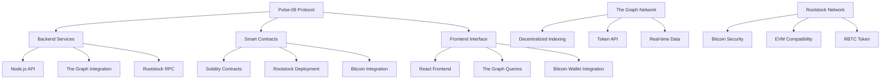

# 🚀 Pulse-08 - Signals Protocol on Rootstock

[](https://rootstock.io/)
[](https://thegraph.com/)
[](https://bitcoin.org/)
[](./README.md)

> **Complete Signals Protocol implementation on Rootstock Bitcoin sidechain with The Graph token API integration for advanced indexing and analytics.**

---

## 📋 Table of Contents

- [🎯 Overview](#-overview)
- [🏗️ Architecture](#️-architecture)
- [📁 Project Structure](#-project-structure)
- [🔧 Core Components](#-core-components)
- [🚀 Getting Started](#-getting-started)
- [🛠️ Development](#️-development)
- [📊 The Graph Integration](#-the-graph-integration)
- [🔗 Rootstock Integration](#-rootstock-integration)

---

## 🎯 Overview

**Pulse-08** is a complete implementation of the Signals Protocol prediction market system built specifically for the Rootstock Bitcoin sidechain. This project leverages The Graph's decentralized indexing protocol for advanced data analytics and real-time market insights.

### ✨ Key Features

- **🎯 Bitcoin-Native Prediction Markets** - Built on Rootstock for Bitcoin ecosystem integration
- **📊 Advanced Analytics** - The Graph token API for comprehensive market data
- **🔗 Bitcoin Sidechain** - Leverages Rootstock's EVM compatibility with Bitcoin security
- **📈 Real-time Indexing** - Decentralized data indexing with The Graph
- **🛡️ Bitcoin Security** - Inherits Bitcoin's security model through Rootstock
- **⚡ High Performance** - Optimized for Bitcoin sidechain environment

---

## 🏗️ Architecture

### Technology Stack



### Core Architecture Principles

1. **Bitcoin-Native Design** - Built for Bitcoin ecosystem integration
2. **Decentralized Indexing** - The Graph for data availability and reliability
3. **EVM Compatibility** - Leverages Rootstock's Ethereum compatibility
4. **Security First** - Inherits Bitcoin's security model
5. **Performance Optimized** - Designed for Bitcoin sidechain environment

---

## 📁 Project Structure

```
pulse-08/
├── 📄 README.md                    # This comprehensive documentation
├── 📄 package.json                # Root package configuration
├── 📄 tsconfig.json               # TypeScript configuration
├── 📄 .env.example                # Environment variables template
├── 📄 .gitignore                  # Git ignore rules
├── 📄 docker-compose.yml          # Development environment
├── 🔧 backend/                    # Backend Services
│   ├── 📄 package.json            # Backend dependencies
│   ├── 📄 tsconfig.json           # Backend TypeScript config
│   ├── 📄 .env.example            # Backend environment
│   ├── 🛠️ src/                    # Backend source code
│   │   ├── 📄 index.ts            # Main server entry
│   │   ├── 🔧 api/                # API routes
│   │   │   ├── 📄 markets.ts      # Market endpoints
│   │   │   ├── 📄 positions.ts    # Position endpoints
│   │   │   ├── 📄 users.ts        # User endpoints
│   │   │   └── 📄 analytics.ts    # Analytics endpoints
│   │   ├── 🔧 services/            # Business logic
│   │   │   ├── 📄 rootstock.ts    # Rootstock integration
│   │   │   ├── 📄 thegraph.ts     # The Graph integration
│   │   │   ├── 📄 market.ts       # Market logic
│   │   │   └── 📄 position.ts     # Position logic
│   │   ├── 🔧 utils/              # Utility functions
│   │   │   ├── 📄 logger.ts       # Logging utilities
│   │   │   ├── 📄 validation.ts   # Input validation
│   │   │   └── 📄 crypto.ts       # Cryptographic utilities
│   │   └── 🔧 types/              # TypeScript types
│   │       ├── 📄 market.ts       # Market types
│   │       ├── 📄 position.ts     # Position types
│   │       └── 📄 user.ts         # User types
│   ├── 🧪 tests/                  # Backend tests
│   │   ├── 📄 api.test.ts         # API tests
│   │   ├── 📄 services.test.ts    # Service tests
│   │   └── 📄 utils.test.ts       # Utility tests
│   └── 📄 Dockerfile              # Backend container
├── 🔗 contracts/                  # Smart Contracts
│   ├── 📄 package.json            # Contract dependencies
│   ├── 📄 hardhat.config.ts       # Hardhat configuration
│   ├── 📄 .env.example            # Contract environment
│   ├── 🔧 contracts/              # Solidity contracts
│   │   ├── 📄 CLMSRMarketCore.sol # Main market contract
│   │   ├── 📄 CLMSRPosition.sol   # Position NFT contract
│   │   ├── 📄 interfaces/         # Contract interfaces
│   │   │   ├── 📄 ICLMSRMarketCore.sol
│   │   │   └── 📄 ICLMSRPosition.sol
│   │   ├── 📄 libraries/          # Contract libraries
│   │   │   ├── 📄 FixedPointMath.sol
│   │   │   └── 📄 LazyMulSegmentTree.sol
│   │   ├── 📄 errors/             # Custom errors
│   │   │   ├── 📄 CLMSRErrors.sol
│   │   │   └── 📄 PositionErrors.sol
│   │   └── 📄 mocks/              # Mock contracts
│   │       └── 📄 MockRBTC.sol    # Mock RBTC for testing
│   ├── 🔧 scripts/                # Deployment scripts
│   │   ├── 📄 deploy.ts           # Main deployment
│   │   ├── 📄 verify.ts           # Contract verification
│   │   └── 📄 upgrade.ts           # Upgrade scripts
│   ├── 🧪 test/                   # Contract tests
│   │   ├── 📄 CLMSRMarketCore.test.ts
│   │   ├── 📄 CLMSRPosition.test.ts
│   │   └── 📄 integration/        # Integration tests
│   └── 📄 Dockerfile              # Contract container
├── 🎨 frontend/                   # Frontend Interface
│   ├── 📄 package.json            # Frontend dependencies
│   ├── 📄 vite.config.ts          # Vite configuration
│   ├── 📄 tailwind.config.js      # Tailwind CSS config
│   ├── 📄 .env.example            # Frontend environment
│   ├── 🎨 src/                    # Frontend source
│   │   ├── 📄 main.tsx            # Main entry point
│   │   ├── 📄 App.tsx             # Root component
│   │   ├── 🔧 components/         # React components
│   │   │   ├── 📄 Market/         # Market components
│   │   │   ├── 📄 Position/       # Position components
│   │   │   ├── 📄 Analytics/      # Analytics components
│   │   │   └── 📄 Common/         # Common components
│   │   ├── 🔧 pages/              # Page components
│   │   │   ├── 📄 Home.tsx        # Home page
│   │   │   ├── 📄 Markets.tsx     # Markets page
│   │   │   ├── 📄 Positions.tsx   # Positions page
│   │   │   └── 📄 Analytics.tsx   # Analytics page
│   │   ├── 🔧 hooks/              # Custom hooks
│   │   │   ├── 📄 useMarket.ts    # Market hooks
│   │   │   ├── 📄 usePosition.ts  # Position hooks
│   │   │   └── 📄 useTheGraph.ts  # The Graph hooks
│   │   ├── 🔧 services/           # API services
│   │   │   ├── 📄 api.ts          # API client
│   │   │   ├── 📄 thegraph.ts     # The Graph client
│   │   │   └── 📄 rootstock.ts  # Rootstock client
│   │   ├── 🔧 utils/              # Utility functions
│   │   │   ├── 📄 formatters.ts   # Data formatters
│   │   │   ├── 📄 validators.ts   # Input validators
│   │   │   └── 📄 constants.ts    # App constants
│   │   └── 🔧 types/              # TypeScript types
│   │       ├── 📄 market.ts       # Market types
│   │       ├── 📄 position.ts     # Position types
│   │       └── 📄 api.ts          # API types
│   ├── 🧪 tests/                  # Frontend tests
│   │   ├── 📄 components.test.tsx
│   │   ├── 📄 pages.test.tsx
│   │   └── 📄 hooks.test.tsx
│   └── 📄 Dockerfile              # Frontend container
├── 📊 subgraph/                   # The Graph Subgraph
│   ├── 📄 package.json            # Subgraph dependencies
│   ├── 📄 schema.graphql          # GraphQL schema
│   ├── 📄 subgraph.yaml           # Subgraph manifest
│   ├── 📄 .env.example            # Subgraph environment
│   ├── 🔧 src/                    # Subgraph source
│   │   ├── 📄 mappings/           # Event mappings
│   │   │   ├── 📄 market.ts       # Market event handlers
│   │   │   ├── 📄 position.ts     # Position event handlers
│   │   │   └── 📄 user.ts         # User event handlers
│   │   ├── 📄 utils/             # Utility functions
│   │   │   ├── 📄 math.ts         # Mathematical utilities
│   │   │   └── 📄 helpers.ts      # Helper functions
│   │   └── 📄 types/              # TypeScript types
│   │       ├── 📄 market.ts       # Market types
│   │       └── 📄 position.ts     # Position types
│   ├── 🧪 tests/                  # Subgraph tests
│   │   ├── 📄 market.test.ts
│   │   └── 📄 position.test.ts
│   └── 📄 Dockerfile              # Subgraph container
└── 📚 docs/                       # Documentation
    ├── 📄 API.md                  # API documentation
    ├── 📄 CONTRACTS.md            # Contract documentation
    ├── 📄 FRONTEND.md             # Frontend documentation
    ├── 📄 SUBGRAPH.md             # Subgraph documentation
    └── 📄 DEPLOYMENT.md            # Deployment guide
```

---

## 🔧 Core Components

### 1. **Backend Services**
- **Node.js API Server** with TypeScript
- **Rootstock Integration** for blockchain interaction
- **The Graph Integration** for decentralized indexing
- **RESTful API** for frontend communication
- **Real-time WebSocket** support for live updates

### 2. **Smart Contracts**
- **CLMSRMarketCore.sol** - Main market logic
- **CLMSRPosition.sol** - Position NFT management
- **Rootstock Deployment** - Optimized for Bitcoin sidechain
- **RBTC Integration** - Native Bitcoin token support

### 3. **Frontend Interface**
- **React 18** with TypeScript
- **Vite** for fast development
- **Tailwind CSS** for styling
- **The Graph Queries** for data fetching
- **Bitcoin Wallet Integration** for Rootstock

### 4. **The Graph Subgraph**
- **Decentralized Indexing** of blockchain events
- **Real-time Data** synchronization
- **GraphQL API** for frontend queries
- **Token API Integration** for advanced analytics

---

## 🚀 Getting Started

### **Prerequisites**
- Node.js 18+
- Yarn package manager
- Docker and Docker Compose
- Rootstock wallet (MetaMask with Rootstock network)
- The Graph CLI

### **Installation**
```bash
# Clone the repository
git clone <repository-url>
cd pulse-08

# Install root dependencies
yarn install

# Install all subproject dependencies
yarn install:all

# Start development environment
yarn dev
```

### **Environment Setup**
```bash
# Copy environment files
cp .env.example .env
cp backend/.env.example backend/.env
cp contracts/.env.example contracts/.env
cp frontend/.env.example frontend/.env
cp subgraph/.env.example subgraph/.env

# Configure environment variables
# Edit .env files with your configuration
```

---

## 🛠️ Development

### **Available Scripts**
```bash
# Root level scripts
yarn dev              # Start all services
yarn build            # Build all projects
yarn test             # Run all tests
yarn lint             # Lint all code
yarn clean            # Clean all build artifacts

# Backend scripts
yarn backend:dev      # Start backend development
yarn backend:build    # Build backend
yarn backend:test     # Test backend

# Contract scripts
yarn contracts:compile # Compile contracts
yarn contracts:test   # Test contracts
yarn contracts:deploy # Deploy contracts

# Frontend scripts
yarn frontend:dev     # Start frontend development
yarn frontend:build   # Build frontend
yarn frontend:test    # Test frontend

# Subgraph scripts
yarn subgraph:codegen # Generate subgraph code
yarn subgraph:build   # Build subgraph
yarn subgraph:deploy  # Deploy subgraph
```

### **Development Workflow**
1. **Start Development Environment**: `yarn dev`
2. **Deploy Contracts**: `yarn contracts:deploy`
3. **Deploy Subgraph**: `yarn subgraph:deploy`
4. **Start Frontend**: `yarn frontend:dev`
5. **Test Integration**: Access frontend at `http://localhost:3000`

---

## 📊 The Graph Integration

### **Subgraph Features**
- **Real-time Event Indexing** from Rootstock
- **Market Data Aggregation** for analytics
- **User Position Tracking** with P&L calculation
- **Token API Integration** for advanced metrics

### **GraphQL Schema**
```graphql
type Market @entity {
  id: ID!
  marketId: BigInt!
  isActive: Boolean!
  isSettled: Boolean!
  minTick: BigInt!
  maxTick: BigInt!
  tickSpacing: BigInt!
  startTimestamp: BigInt!
  endTimestamp: BigInt!
  settlementTick: BigInt
  positions: [Position!]! @derivedFrom(field: "market")
  trades: [Trade!]! @derivedFrom(field: "market")
}

type Position @entity {
  id: ID!
  positionId: BigInt!
  user: User!
  market: Market!
  lowerTick: BigInt!
  upperTick: BigInt!
  quantity: BigInt!
  costBasis: BigInt!
  outcome: String!
  isClaimed: Boolean!
  trades: [Trade!]! @derivedFrom(field: "position")
}

type User @entity {
  id: ID!
  address: Bytes!
  positions: [Position!]! @derivedFrom(field: "user")
  trades: [Trade!]! @derivedFrom(field: "user")
  totalVolume: BigInt!
  totalPnL: BigInt!
}

type Trade @entity {
  id: ID!
  user: User!
  market: Market!
  position: Position!
  type: String!
  quantity: BigInt!
  cost: BigInt!
  timestamp: BigInt!
  transactionHash: Bytes!
}
```

---

## 🔗 Rootstock Integration

### **Network Configuration**
- **Network**: Rootstock Mainnet/Testnet
- **RPC URL**: Rootstock RPC endpoint
- **Chain ID**: 30 (Mainnet) / 31 (Testnet)
- **Currency**: RBTC (Rootstock Bitcoin)

### **Contract Deployment**
- **Deployment Scripts** for Rootstock
- **Verification** on Rootstock explorer
- **Upgrade Management** for contract updates
- **Gas Optimization** for Bitcoin sidechain

### **Bitcoin Integration**
- **RBTC Token** support
- **Bitcoin Security** model inheritance
- **Cross-chain** compatibility
- **Bitcoin Wallet** integration

---

## 📈 Advanced Features

### **Analytics Dashboard**
- **Real-time Market Data** from The Graph
- **User Performance** tracking
- **Market Statistics** and trends
- **Token API Integration** for advanced metrics

### **Bitcoin-Native Features**
- **RBTC Integration** for payments
- **Bitcoin Wallet** support
- **Cross-chain** compatibility
- **Bitcoin Security** model

### **The Graph Token API**
- **Decentralized Indexing** for reliability
- **Real-time Data** synchronization
- **Advanced Analytics** capabilities
- **Token-based** query pricing

---

## 🚀 Deployment

### **Production Deployment**
```bash
# Deploy contracts to Rootstock
yarn contracts:deploy:mainnet

# Deploy subgraph to The Graph
yarn subgraph:deploy:mainnet

# Deploy backend services
yarn backend:deploy

# Deploy frontend
yarn frontend:deploy
```

### **Environment Configuration**
- **Rootstock Mainnet** for production
- **The Graph Network** for indexing
- **Production API** endpoints
- **SSL/TLS** security

---

## 🤝 Contributing

### **Development Setup**
1. Fork the repository
2. Create a feature branch
3. Make your changes
4. Test thoroughly
5. Submit a pull request

### **Code Standards**
- **TypeScript** for all new code
- **ESLint** for code quality
- **Prettier** for code formatting
- **Jest** for testing

---

## 📄 License

This project is licensed under the MIT License - see the [LICENSE](LICENSE) file for details.

---

## 🙏 Acknowledgments

- **Rootstock Team** for Bitcoin sidechain infrastructure
- **The Graph Team** for decentralized indexing
- **Bitcoin Community** for security model
- **Ethereum Community** for EVM compatibility

---

**Built with ❤️ for the Bitcoin and Rootstock ecosystem**

*For more information, visit [Rootstock](https://rootstock.io/) or [The Graph](https://thegraph.com/).*
